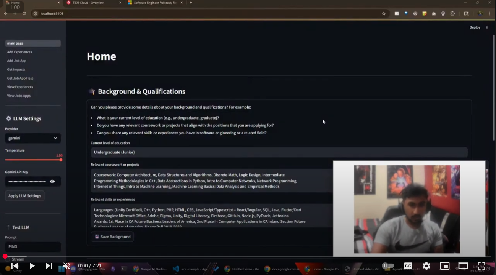

# ResumeAI - Hackathon Project 

[](https://www.youtube.com/watch?v=p5ZQ9iI1opE&list=PLWT28nFa-4QHMBsCbJ9-zXTYULeur_2T2&index=2)


## Instruction to Run Project

### Step 1: Setup the env files

1. copy the .env.example file and save it as .env and fill in the credientials based on your custom cluster

2. download the CA cert from your cluster's generated credentials and save it to local

3. link the path of the CA cert to the env file

### Step 2: Run file

To run the fill, run the follow command:

```
streamlit run src/main_page.py
```

## Inspiration
Keeping track of 20+ applications a day was draining. I’d tweak a resume line here, change a bullet there, and by the end of the week I couldn’t remember what worked or why. I also didn’t want AI that overwrote my voice. That pushed me to build a tool that retrieves my own history and context first—so answers, bullets, and emails are grounded in what I’ve actually done, not generic filler.

## What it does

**ResumeAI** is a lightweight RAG assistant for job hunting:

**Job Applications Log**: add roles, status, links, contacts, notes; update via a clean dropdown.

**Experiences Log**: capture internships/projects/work/leadership with dates, tech, description, and impact.

**Impact Editor**: pick an experience, generate/edit bullets, and save back to the DB.

**Context-aware Chat**: chat per application (or “General”) with RAG over your experiences + background so replies stay in your voice.

**Background Profile**: one form for education, relevant coursework/projects, and skills; this is automatically included in LLM context.

**Home Dashboard**: “Recently added” cards for apps/experiences + quick jump to edit.

**LLM Router**: switch between Ollama, OpenAI, or Gemini at runtime from the sidebar; includes a one-click test.

## How we built it
**Frontend**: Streamlit multipage app (Home, Applications, Experiences). Careful st.session_state patterns to keep per-app chats and impact edits stable.

**Storage**: MySQL with pooled connections (via mysql.connector), .env config (python-dotenv), parameterized queries, and schema helpers:

- job_applications, experiences, and user_background.

**RAG Core**: Python helpers that rank experiences against the user question + (optionally) the selected application. Context = Background + Application + Top-K Experiences.

**LLM Layer**: a single llm_helper.py with:

- runtime config (set_runtime_llm_config, get_runtime_llm_config) persisted in st.session_state,

- unified _call_llm that hits Ollama, OpenAI, or Gemini,

- task-specific prompts for QA, bullets, and emails.

**Quality of life**: Sidebar LLM settings, health-check (“PING→PONG”), and safe schema creation on page load.

## Challenges we ran into
**Streamlit form constraints**: st.button() inside forms and modifying session_state after widget instantiation caused exceptions. Fixed with form_submit_button patterns and a “pending value” key (__next) + st.rerun().

**Shared LLM settings across pages**: Multipage apps re-run independently. Provider/model settings looked “stuck” on Ollama until we persisted config to st.session_state.llm_cfg and always read via get_runtime_llm_config().

**First-run DB errors**: Missing tables (e.g., user_background) threw 1146 errors. Solved with ensure_*_schema() on page init and defensive try/ensure in helpers.

**Package gotcha**: Installing gemini (wrong) instead of google-generativeai (right) caused wheel build failures on Windows. Cleaned env and installed the correct SDK.

**Voice preservation**: Tuning prompts so the model augments, not overwrites. The system messages now instruct the LLM to use only retrieved context and ask for specifics when missing.


## Accomplishments that we're proud of
A full end-to-end RAG loop that keeps answers grounded in my experiences and background.

Provider-agnostic LLM with live switching (Ollama/OpenAI/Gemini) and a quick test harness.

Practical UX: per-application chat threads, readable dropdowns, recent-item cards, and an impact editor that writes back to the DB.

Robust data layer: pooled connections, safe SQL, schema helpers, and easy CSV export when needed.


## What we learned
Streamlit state management is simple but strict—plan widget keys and updates carefully.

RAG doesn’t need to be heavy to be useful; even keyword overlap + good prompt scaffolding is a strong baseline when your data is clean.

Clear system prompts (“use only this context; ask for what’s missing”) dramatically improves relevance and preserves user voice.

Users (me included) want control over the LLM—provider choice, model name, temperature, and an obvious “is it even on?” test.


## What's next for ResumeAI

Better retrieval: move from keyword overlap to MySQL FULLTEXT or embeddings (FAISS/pgvector) for semantic matches.

Interview mode: generate targeted practice questions + graded answers from the same context.

Versioned resumes: track resume variants per application and surface which edits correlate with callbacks.

Integrations: optional sync to Google Sheets/Notion; calendar tasks for follow-ups; email sending for thank-yous.

Multi-user + auth: user accounts, isolated data, and encrypted at-rest secrets.

Analytics: funnels and timelines (applications per week, response rates by role/company).